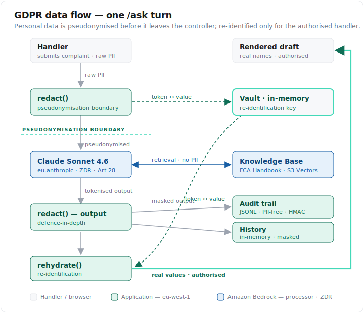

# FCA Complaints Handling Bot

A retrieval-augmented assistant for bank complaints handlers. Given a complaint scenario, it looks up the relevant FCA Handbook provisions, drafts a compliant response grounded in the retrieved regulatory text, and cites the specific provisions it relied on. Built on AWS Bedrock Knowledge Bases, with output quality measured by a drafting-aware adaptation of the dual LLM-as-judge harness from [rag-eval-framework](https://github.com/jacarty/rag-eval-framework).

> **Educational project — not a real system.** This was built as a learning exercise for an Imperial College London course, to demonstrate RAG techniques end to end (structure-aware chunking, grounded drafting with structured outputs, and LLM-as-judge evaluation). It is **not** a production tool, and its output is **not** legal, regulatory, or compliance advice. It runs on synthetic bank policies and synthetic complaint scenarios; nothing here should be used to handle a real complaint or relied on as an interpretation of the FCA Handbook.

## Status

The build is complete; the write-up is in progress. This repository clones the evaluation framework from `rag-eval-framework` and applies it to a working use case: an FCA complaints handling assistant. The eval framework quantified that **structure-aware chunking delivers ~3× the retrieval precision of fixed-size splitting** on FCA regulatory text; this project puts that finding to work and tests whether it still holds when the task is *response drafting* rather than factual Q&A.

| Stage | State |
|-------|-------|
| Repo scaffold & tidy | Complete |
| Corpus rebuild (add DISP + CONC) | Complete |
| Bot build (retrieval + drafting + UI) | Complete |
| Complaint ground-truth set | Complete |
| Eval adaptation & run | Complete |
| Compliance & security hardening | Complete |
| Write-up | Not Started |

## What This Is

A focused, single-purpose RAG application that:

1. Retrieves relevant FCA Handbook provisions for a complaint scenario (Bedrock Knowledge Base, structure-aware chunking, Titan embeddings)
2. Drafts a compliant response with Claude Sonnet 4.6 using structured outputs, constrained to cite the provisions it used and to flag where human review is required
3. Supports follow-up questions within a conversation ("what's the time limit for this type of complaint?")
4. Is evaluated with an adapted dual-judge harness that scores regulatory grounding, required-element coverage, citation correctness, and hallucination rate

The corpus is UK Financial Conduct Authority (FCA) Handbook text. Complaint handling is governed primarily by the **DISP** (Dispute Resolution: Complaints) sourcebook — the rules on effective handling, the time limits for a final response, and the complainant's right to refer to the Financial Ombudsman Service — alongside **PRIN** (Consumer Duty) and the conduct sourcebooks. Alongside the regulatory text, a set of synthetic bank compliance policies (pinned markdown, carried over from the foundation project) sit in the same knowledge base, so the bot can ground a response in both the regulator's rules and the bank's internal policy.

## Foundation

This project is built on [rag-eval-framework](https://github.com/jacarty/rag-eval-framework). It reuses the *approach and code* — the FCA scraper, the structure-aware chunker, the Bedrock Knowledge Base setup, the retrieval pipeline, and the dual-judge eval harness — but it is **fully self-contained**: its own S3 bucket (`fca-complaints-bot`), its own knowledge bases, and its own corpus, all built from scratch by the scripts in this repo. Nothing is shared with the eval framework's live infrastructure. The key differences:

- **Corpus** — the foundation corpus did not include DISP. The complaints bot cannot function without it, so the scraper adds DISP (and CONC for consumer-credit complaints), and the corpus is rebuilt fresh in this project's own bucket.
- **Task** — the foundation evaluated factual Q&A. This bot *drafts responses*, so the generation layer and the judge rubric are reworked for a drafting task where much of a good response is legitimately not drawn from the Handbook.
- **Interface** — a FastAPI + HTMX web UI a complaints handler can actually use, rather than a CLI eval runner.

## Architecture

```
FCA Handbook API ──→ scrape_fca.py (DISP + CONC + conduct modules)
                          │
                          ▼
              convert_fca_to_sections.py  (whole-section markdown)
                          │
                          ▼
              structure-aware chunker  (provision-level, token-capped)
                          │                  Synthetic bank policies
                          │                  (data/synthetic/policies/)
                          ▼                          │
              Bedrock Knowledge Base  ◄──────────────┘
              (S3 Vectors · Titan V2 · bucket: fca-complaints-bot)
              structure-titan (bot)  +  fixed-titan (eval comparison)
                          │
                          ▼ Retrieve API (semantic)
                          │
   ┌──────────────────────────────────────────────────────┐
   │  app/ (FastAPI + HTMX)                                 │
   │  complaint scenario → retrieve provisions →           │
   │  Claude Sonnet 4.6 drafts a cited, compliant response │
   │  (structured outputs; flags human-review cases)        │
   └──────────────────────────────────────────────────────┘
                          │
                          ▼
   ┌──────────────────────────────────────────────────────┐
   │  Eval harness (scripts/run_eval.py)                    │
   │  complaint scenarios × {structure, fixed} chunking     │
   │  dual judges: Claude Haiku 4.5 + GPT-oss-120b          │
   │  regulatory grounding · required elements ·            │
   │  citation correctness · hallucination rate             │
   └──────────────────────────────────────────────────────┘
```

## Repository Structure

```
fca-complaints-bot/
├── src/
│   ├── pipeline.py           # Retrieval + response drafting (Pydantic-typed)
│   ├── judge.py              # Drafting-aware dual LLM-as-judge
│   ├── metrics.py            # Grounding, citation correctness, required-element coverage
│   ├── scraper/              # FCA Handbook API client
│   └── chunking/             # Structure-aware chunker
├── app/
│   ├── main.py               # FastAPI app
│   ├── templates/            # Jinja2 + HTMX
│   └── static/               # Styles
├── scripts/
│   ├── scrape_fca.py         # Scrape FCA Handbook (incl. DISP, CONC) to JSONL
│   ├── convert_fca_to_sections.py  # Split JSONL → section markdown
│   ├── setup_knowledge_bases.py    # Create bucket + KBs, sync FCA + policies
│   ├── generate_policies.py  # Synthetic bank policy generator (provenance; not re-run)
│   ├── generate_qa.py        # Generate complaint ground-truth set
│   ├── query.py              # CLI for manual retrieval/draft testing
│   └── run_eval.py           # Evaluation runner with per-question checkpointing
├── config/
│   └── knowledge_bases.json  # KB IDs and configuration
├── data/
│   ├── fca/                  # FCA source data (pinned)
│   ├── synthetic/            # Synthetic bank policies (pinned markdown + metadata)
│   ├── qa/                   # Complaint ground-truth set
│   ├── prompts/              # Drafting and judge prompts
│   └── eval/                 # Evaluation results (gitignored except summaries)
├── docs/
│   └── adr/                  # Architecture decision records
├── pyproject.toml
└── .env.example
```

## Evaluation

A complaint response is not a factual answer: a good one is mostly *not* drawn from the Handbook (acknowledgement, empathy, investigation summary, next steps). The eval is therefore split into dimensions the foundation's claim-grounding judge did not separate:

- **Regulatory grounding** — are the regulatory claims correct and supported by retrieved provisions? No invented rules.
- **Citation correctness** — does the response cite the *correct* provision (e.g. the right DISP rule), not merely a retrieved one?
- **Required-element coverage** — does the response include the elements a compliant reply must contain (e.g. FOS referral rights, the response time limit)?
- **Hallucination rate** — claims with no support in any retrieved provision.

Each scenario records two ground truths: the provisions that *should* be retrieved, and the response elements a compliant reply must contain. Scenarios span single-complaint, multi-provision, and escalation types.

## Security & Compliance

Although the bot runs entirely on synthetic data, it carries a hardening layer built *as if* it handled real complainant PII — so the data-protection and regulatory story is demonstrated end to end. The emphasis is on controls that are **evidenced in the code**, paired with an honest account of what a production deployment would still need. Full detail lives in [`docs/gdpr_data_flow.md`](docs/gdpr_data_flow.md) and [`docs/compliance_mapping.md`](docs/compliance_mapping.md).

**Data protection by design.** Personal data is pseudonymised *before* it leaves the controller's boundary:

- **PII redaction** — reversible, session-scoped tokenisation at a redaction boundary; the model, the conversation history and the audit log only ever see tokens (`[NAME_1]`, `[ACCOUNT_2]`). Raw PII never reaches Bedrock.
- **Re-identification** is confined to the boundary: real values are restored (`rehydrate()`) only for the authorised handler's rendered view.
- **Defence in depth** — redaction runs on both the inbound question and the model's output, so an entity missed on the way in gets a second chance on the way out.
- **Measured, not assumed** — a labelled eval set puts redaction at **96% recall / 64% precision**. The profile is deliberately *safe-but-imprecise*: it over-masks public and organisation names (a regex detector cannot always tell a person from a company) rather than risk leaking a real one. That precision ceiling is the documented reason a production build would move to entity-typed detection (Amazon Comprehend / Bedrock Guardrails).

**PII-free audit trail.** Every `/ask` turn appends one record to a JSONL trail — but never any PII:

- the input is stored only as a keyed **HMAC-SHA256 hash** (not the raw text), alongside the masked output, model ID, cited provisions, retrieval and review flags, latency and token usage;
- it is append-only and queryable via `scripts/query_audit.py` (filter by session, date, review-only);
- writes **fail open** — an audit failure is logged but never breaks the handler's response. That trade-off favours availability over guaranteed capture, and is flagged as a gap for regulated use.

**EU data residency.** The whole path is EU-pinned, by two different mechanisms: **generation** is pinned by the `eu.anthropic.*` inference profile, and **retrieval** is pinned by resource location — the Knowledge Base, Titan embeddings and S3 Vectors index all live in `eu-west-1`.



**Known gaps (by design, for a demonstration build).** These are documented rather than hidden — closing them is the difference between a demo and a deployment:

- the re-identification **Vault is in-memory and unencrypted**, with no TTL, persistence or access control — the highest-value asset and the first thing to harden;
- **no authentication** — a single-user cookie session;
- **fail-open audit** (above);
- **redaction precision** (above) — regex NER, not entity-typed;
- **TLS is assumed** for any non-local deployment (the dev server is plain HTTP on localhost).

A full control-by-requirement mapping across **GDPR, FCA/PRA, DORA and the EU AI Act** — including the documented non-high-risk AI Act assessment — is in [`docs/compliance_mapping.md`](docs/compliance_mapping.md).

## How to Run

> Reproducible end to end — every stage (scrape, index, run, evaluate) is scripted. You'll need your own AWS account and Bedrock model access; the corpus and knowledge bases are built fresh into your own bucket.

### Prerequisites

- Python 3.13+
- [uv](https://docs.astral.sh/uv/)
- AWS account with Bedrock model access: Claude Sonnet 4.6, Claude Haiku 4.5, Amazon Titan Embeddings v2, GPT-oss-120b
- AWS CLI configured with a named profile

### Setup

```bash
cp .env.example .env   # edit with your AWS config
uv sync
```

### Build the corpus and knowledge base

```bash
uv run python scripts/scrape_fca.py                # incl. DISP + CONC
uv run python scripts/convert_fca_to_sections.py
uv run python scripts/setup_knowledge_bases.py
```

### Run the app

```bash
uv run uvicorn app.main:app --reload
```

### Run the evaluation

```bash
uv run python scripts/run_eval.py --resume
```

## Related

- [rag-eval-framework](https://github.com/jacarty/rag-eval-framework) — the evaluation framework this project is built on

## Licence

MIT
